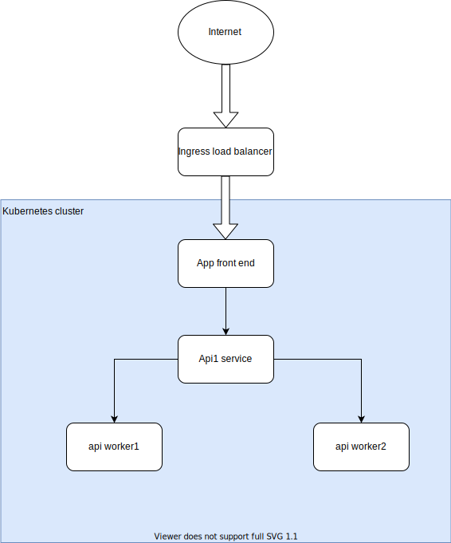

# Helm Charts Demo

Helm charts demo project to demonstrate hot to set up and run applications in kubernetes service.

## Pre requirements

- Helm Charts https://helm.sh/docs/intro/install/
- Kubectl https://v1-16.docs.kubernetes.io/docs/tasks/tools/install-kubectl/
- Kubernetes cluster

### Free kubernetes custer

You can can create free kubernetes cluster in IBM Cloud: https://cloud.ibm.com/kubernetes/catalog/create (valid for 30 days)

```
Worker node
    Free
    Free - 2 vCPUs 4GB RAM
```

## Application overview



## Development

This project was tested using IKS (IBM Kubernetes Service) version: 1.18

### Test kubernetes cluster

```sh
$ kubectl config current-context
```

Output:

```
mycluster-free/bsugk*****tapchh0
```

## Linting

To Check if project does not have any syntax errors:

```sh
$ helm lint
```

## Generate helm charts

```sh
$ helm install --dry-run --debug --generate-name  . > result.yaml 2> error.log
```

### User supplied values

When storing helm charts it is not recommended to store passwords in code.
To avoid this problem when installing helm charts you can use user supplied options.
This is very useful when you moving cross environments and you do not want to create new harts version because some values are diff rent cross environments

- Example:

```sh
$ helm install --dry-run --debug --generate-name --set general.environment=QA  . > result.yaml 2>error.log
```

This will reset value in `values.yaml` from:

```
general:
  environment: DEV
```

To:

```
general:
  environment: QA
```

### Deployment

When charts are ready for run:

```sh
$ helm install
```

### More information

For more information please read more: https://helm.sh/docs/chart_template_guide/debugging/

## TODO

- Add ingress template
- Add service template
